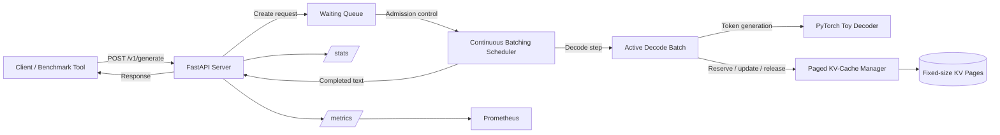
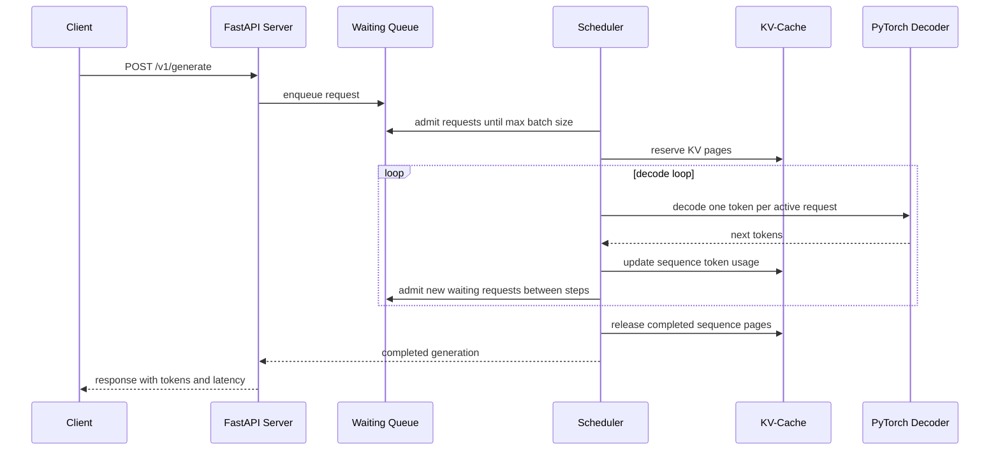
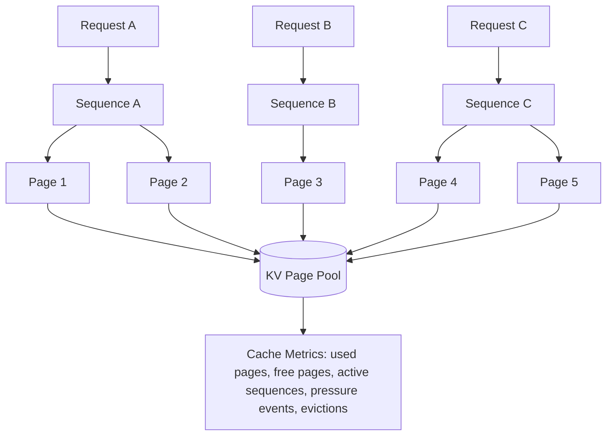

# InferEngine

[](https://github.com/souvikDevloper/InferEngine/actions)


**InferEngine** is a laptop-runnable inference serving engine that models the systems mechanics behind modern LLM serving platforms: continuous batching, paged KV-cache accounting, async request admission, decode-step scheduling, and serving telemetry.

It exposes a FastAPI generation API, runs requests through a continuous batching scheduler, tracks KV-cache page usage, releases sequence memory after completion, and exports Prometheus metrics for latency, throughput, queue depth, and cache pressure.

> InferEngine is intentionally designed as a systems project, not a full vLLM replacement. It focuses on the serving architecture: scheduler behavior, KV-cache lifecycle, request concurrency, and observability.

---

## Highlights

- FastAPI inference server with `/v1/generate`, `/stats`, `/health`, and `/metrics`
- Async continuous batching scheduler for concurrent generation requests
- Paged KV-cache manager with per-sequence token accounting
- LRU/FIFO-style cache eviction policy support
- Active and waiting request queues
- Decode-step admission to reduce head-of-line blocking
- Lightweight PyTorch decoder for CPU-friendly local execution
- Prometheus metrics for throughput, latency, queue depth, and cache pressure
- Benchmark client for concurrent load testing
- Docker and Docker Compose support
- PyTest-based unit and async scheduler tests
- GitHub Actions CI workflow

---

## Architecture



Requests enter the API, move into the waiting queue, and are admitted into active decode batches. The scheduler performs one decode step per active request, updates KV-cache accounting, admits newly arrived work between decode steps, and completes each request once its generation budget is reached.

---

## Continuous Batching Flow



Continuous batching avoids waiting for a static batch to fill. New requests can enter between decode steps, which improves batch utilization under concurrent workloads.

---

## KV-Cache Page Model



InferEngine models KV-cache memory as fixed-size pages. Each request reserves pages based on prompt length and generation budget. When a request completes, its pages are released back to the pool.

---

## Tech Stack

| Area | Technology |
|---|---|
| API | FastAPI, Uvicorn |
| Scheduler | AsyncIO continuous batching loop |
| Model Runtime | PyTorch lightweight decoder |
| Cache System | Paged KV-cache accounting |
| Metrics | Prometheus client |
| Benchmarking | Async HTTPX client |
| Testing | PyTest, pytest-asyncio |
| Deployment | Docker, Docker Compose |

---

## Quick Start

### 1. Create a virtual environment

```bash
python -m venv .venv
source .venv/bin/activate
pip install -r requirements.txt
```

### 2. Run tests

```bash
pytest -q
```

Expected result:

```text
5 passed
```

### 3. Start the server

```bash
./scripts/run_server.sh
```

The API runs at:

```text
http://127.0.0.1:8080
```

### 4. Run the demo

In another terminal:

```bash
python scripts/demo.py
```

---

## API Usage

### Generate text

```bash
curl -X POST http://127.0.0.1:8080/v1/generate \
  -H "Content-Type: application/json" \
  -d '{"prompt":"Explain continuous batching", "max_new_tokens":32}'
```

Example response:

```json
{
  "request_id": "8e41a6e7-5e5d-4f0b-8e19-a7a70d5b4a70",
  "text": "scheduler cache token batch memory ...",
  "generated_tokens": 32,
  "latency_ms": 124.52,
  "finish_reason": "length",
  "model": "torch-toy-decoder/cpu"
}
```

### Engine stats

```bash
curl http://127.0.0.1:8080/stats
```

### Prometheus metrics

```bash
curl http://127.0.0.1:8080/metrics
```

---

## Benchmarking

Run a concurrent request benchmark:

```bash
python scripts/bench.py -n 64 -c 16 --tokens 80
```

Sample local result on WSL:

```text
requests=64 concurrency=16 generated_tokens=5120
wall_time_sec=2.155 token_throughput=2375.3_tok/sec
latency_ms p50=452.71 p95=562.75 p99=579.12
avg_batch_size=7.282 max_batch_observed=8
cache_used_pages=0 pressure_events=0 evictions=0
```

The benchmark demonstrates that concurrent requests are admitted into decode batches instead of being served one-by-one. In this run, the scheduler reached a maximum observed batch size of `8` and an average batch size of `7.282`.

Benchmark results depend on hardware, Python runtime, PyTorch build, operating system, and background workload.

---

## Metrics

InferEngine exposes runtime telemetry through `/stats` and `/metrics`.

Tracked signals include:

- completed requests
- generated tokens
- decode steps
- average batch size
- maximum observed batch size
- waiting queue size
- active request count
- KV-cache used/free pages
- cache pressure events
- eviction count
- request latency

Example stats snapshot:

```json
{
  "running": true,
  "model": "torch-toy-decoder/cpu",
  "waiting_requests": 0,
  "active_requests": 0,
  "completed_requests": 64,
  "average_batch_size": 7.282,
  "max_batch_observed": 8,
  "cache": {
    "page_size": 16,
    "max_pages": 1024,
    "used_pages": 0,
    "free_pages": 1024,
    "pressure_events": 0,
    "evictions": 0,
    "policy": "lru"
  }
}
```

`cache_used_pages=0` after a completed benchmark means sequence pages were released correctly after generation completed.

---

## Default Runtime Configuration

| Setting | Default |
|---|---:|
| Max batch size | 8 |
| Max waiting requests | 2048 |
| KV-cache max pages | 1024 |
| KV-cache page size | 16 tokens |
| Decode interval | 2 ms |
| Default max new tokens | 64 |
| Max new token limit | 512 |
| Eviction policy | LRU |

---

## Docker Compose

Start the server with Docker Compose:

```bash
docker compose up --build
```

Then run the demo and benchmark:

```bash
python scripts/demo.py
python scripts/bench.py -n 64 -c 16 --tokens 80
```

---

## Reliability Checks

InferEngine validates core behavior through:

- KV-cache allocation and release tests
- cache-capacity rejection tests
- completed-sequence eviction tests
- async scheduler generation tests
- concurrent batching tests
- CI test execution on every push

---

## Repository Structure

```text
inferengine/api/       FastAPI app and request/response schemas
inferengine/core/      scheduler, cache manager, config, tokenizer
inferengine/model/     lightweight PyTorch decoder
inferengine/metrics/   Prometheus metric definitions
scripts/               server, demo, and benchmark scripts
tests/                 unit and async scheduler tests
docs/                  architecture and benchmark notes
.github/workflows/     CI configuration
```

---

## Current Scope

InferEngine focuses on inference-serving systems behavior. It does not ship a production LLaMA/vLLM replacement.

Current limitations:

- no real transformer checkpoint loading
- no production CUDA attention kernel
- no distributed multi-GPU serving
- no streaming token response yet
- no prefix-cache reuse across requests
- no production autoscaling layer

---

## Roadmap

- Add streaming response support
- Add prefix-cache reuse for shared prompts
- Add configurable scheduler policies
- Add real Hugging Face model adapter
- Add optional Triton kernel experiments
- Add Grafana dashboard for metrics
- Add load-test report under `docs/benchmark.md`

---

## License

MIT License
