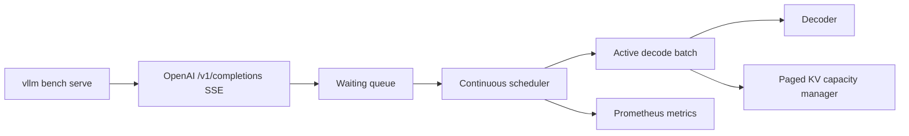

# InferEngine

InferEngine is an inference-serving systems prototype with continuous request admission, decode-step scheduling, paged KV-capacity accounting, streaming OpenAI-compatible completions, and Prometheus telemetry.

The repository now includes a reproducible comparison gate based exclusively on vLLM's official `vllm bench serve` client. It does **not** claim an achieved vLLM-parity number without the required real LLaMA/CUDA implementation and A10G evidence.

## Implemented

- async waiting and active queues;
- continuous admission between decode steps;
- fixed-page KV-capacity allocation with LRU/FIFO pressure policies;
- `/v1/generate`, `/v1/completions`, `/v1/models`, `/health`, `/stats`, and `/metrics`;
- Server-Sent Events with per-token OpenAI completion chunks and usage totals;
- vLLM benchmark-compatible request/response contract;
- official paired benchmark orchestration and a strict 0.91 output-token-throughput gate;
- tests for scheduling, cache lifecycle, concurrent batching, and streaming API compatibility.

## Verification status

| Resume statement | Status | Required evidence |
|---|---|---|
| matched vLLM within 9% on LLaMA-3 8B/A10G | **not yet verified** | two successful official vLLM JSON results + passing `comparison.json` |
| 38% lower GPU fragmentation | **not yet verified** | real CUDA allocator traces for fixed naive and paged-cache experiments |
| 2.1x longer context at the same VRAM | **not yet verified** | maximum admitted context under a fixed measured VRAM cap |
| 76% vs 41% GPU utilization | **not yet verified** | timestamped DCGM/NVML samples over identical 1,000-request runs |

The previous repository only contained a deterministic toy decoder and a custom HTTP benchmark. Those are not adequate evidence for GPU or vLLM comparison claims. The custom benchmark remains useful for development, but not for headline numbers.

## Architecture



## Local development

The default decoder is intentionally small and runs on CPU. It validates serving mechanics, not LLaMA performance.

```bash
python -m venv .venv
source .venv/bin/activate
pip install -e '.[dev]'
pytest -q
uvicorn inferengine.api.main:app --host 127.0.0.1 --port 8000
```

Streaming completion:

```bash
curl -N http://127.0.0.1:8000/v1/completions \
  -H 'content-type: application/json' \
  -d '{"model":"torch-toy-decoder/cpu","prompt":"Explain batching","max_tokens":8,"stream":true,"stream_options":{"include_usage":true}}'
```

## Official vLLM comparison

The benchmark tooling is pinned to vLLM 0.23.0 and invokes the same command twice with the same arguments:

```bash
pip install -r bench/vllm/requirements.txt
INFERENGINE_URL=http://127.0.0.1:8000 \
VLLM_URL=http://127.0.0.1:8001 \
MODEL=meta-llama/Meta-Llama-3-8B \
./bench/vllm/run_pair.sh
```

It retains raw console output, complete official JSON results, per-request details, GPU/software environment, Git revision, and a machine-readable comparison. See [the protocol](docs/benchmark.md).

## Development benchmark

For scheduler regressions only:

```bash
python scripts/bench.py -n 64 -c 16 --tokens 80
```

Do not compare this script's output with vLLM. It is not the official harness and uses the toy model.

## Repository map

```text
inferengine/api/       HTTP and OpenAI-compatible streaming API
inferengine/core/      scheduler, tokenizer, and page allocator
inferengine/model/     laptop-safe development decoder
inferengine/metrics/   Prometheus instruments
bench/vllm/            official paired benchmark orchestration and gate
tests/                 cache, scheduler, and protocol tests
docs/                  architecture and benchmark contract
```

## Next engineering requirement

The parity claim cannot become defensible by tuning the toy decoder. It requires a real LLaMA-3 8B CUDA execution path whose paged KV blocks are consumed by attention kernels, plus an integrated fused QKV kernel. Only after that implementation passes correctness tests should the A10G comparison be run and published.
