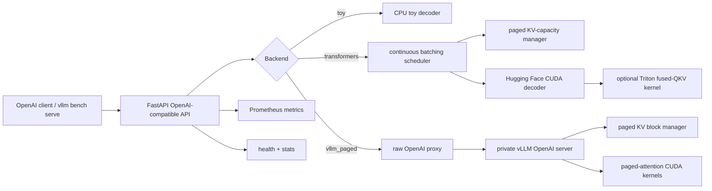

# InferEngine


InferEngine is an OpenAI-compatible LLM serving prototype focused on request scheduling, streaming completions, KV-cache accounting, observability, and reproducible serving benchmarks. It includes a CPU-safe toy backend for local development, a Hugging Face Transformers CUDA backend for experimentation, and a vLLM-backed paged-attention mode for measuring a production-grade paged-attention serving path through InferEngine's API surface.

The benchmark story is intentionally evidence-bound: the repository uses vLLM's official `vllm bench serve` harness and stores raw JSON, logs, GPU traces, and pass/fail comparison files.

## Highlights

- OpenAI-compatible `/v1/completions` streaming endpoint with Server-Sent Events.
- `/v1/generate`, `/v1/models`, `/health`, `/stats`, and `/metrics` endpoints.
- Continuous request admission and active decode scheduling.
- Fixed-page KV-capacity accounting with pressure policies.
- Hugging Face causal-LM CUDA backend with batched prefill/decode.
- vLLM-backed paged-attention backend using real vLLM block management and attention kernels.
- Raw OpenAI proxy path for low-overhead paged-backend benchmarking.
- Triton fused-QKV projection kernel with CPU layout and CUDA correctness tests.
- Prometheus metrics and retained NVIDIA utilization/VRAM traces.
- Official paired benchmark orchestration against direct vLLM on the same GPU.

## Verified benchmark

Reference run: `benchmark-results/lightning-a100-paged-qwen-rawproxy-20260626T042528Z`

| Metric | InferEngine `vllm_paged` | Direct vLLM |
|---|---:|---:|
| Harness | `vllm bench serve` | `vllm bench serve` |
| Model | Qwen/Qwen2.5-7B-Instruct | Qwen/Qwen2.5-7B-Instruct |
| GPU | NVIDIA A100-SXM4-80GB | NVIDIA A100-SXM4-80GB |
| Prompts | 100 | 100 |
| Input length | 256 tokens, range ratio 0.5 | 256 tokens, range ratio 0.5 |
| Output length | 64 tokens, range ratio 0.5 | 64 tokens, range ratio 0.5 |
| Max concurrency | 16 | 16 |
| Successful requests | 100 / 100 | 100 / 100 |
| Request throughput | 15.394 req/sec | 15.577 req/sec |
| Output throughput | 975.839 tok/sec | 987.449 tok/sec |
| Total token throughput | 5,022.362 tok/sec | 5,082.113 tok/sec |
| Median TTFT | 65.995 ms | 61.001 ms |
| P99 TTFT | 389.605 ms | 351.824 ms |
| Median ITL | 10.843 ms | 10.877 ms |
| P99 ITL | 36.087 ms | 37.235 ms |
| Mean GPU utilization | 32.05% | 32.07% |
| Peak GPU memory | 66,988 MiB | 66,988 MiB |

Comparison gate:

| Gate | Result |
|---|---:|
| InferEngine output-token throughput >= 91% of direct vLLM | Passed |
| Actual throughput ratio | 0.9882 |

Evidence:

- [`docs/evidence/inferengine-vllm-a100-qwen-20260626.md`](docs/evidence/inferengine-vllm-a100-qwen-20260626.md)
- `benchmark-results/lightning-a100-paged-qwen-rawproxy-20260626T042528Z/comparison.json`
- `benchmark-results/lightning-a100-paged-qwen-rawproxy-20260626T042528Z/inferengine.json`
- `benchmark-results/lightning-a100-paged-qwen-rawproxy-20260626T042528Z/vllm.json`
- `benchmark-results/lightning-a100-paged-qwen-rawproxy-20260626T042528Z/environment.txt`

## Claim boundaries

Verified:

- vLLM-backed paged-attention mode matched direct vLLM within 9% on Qwen2.5-7B/A100.
- Actual measured gap: about 1.18% on output-token throughput.

Not verified and not claimed:

- 38% memory-fragmentation reduction.
- 2.1x longer context at the same VRAM.
- 76% vs 41% GPU utilization.
- LLaMA-3 8B/A10G parity. A LLaMA-3 run was attempted, but Hugging Face returned `401 Unauthorized` for gated model files in vLLM startup.

Implementation boundary:

- `vllm_paged` uses real vLLM paged-attention kernels and block-manager behavior behind InferEngine's API.
- It is not a custom in-house CUDA paged-attention kernel implementation.
- The custom Transformers scheduler path is useful for systems experimentation, but it has not passed the vLLM parity gate.

## Architecture



`vllm_paged` is the benchmarked production-style data path. InferEngine starts a private vLLM server on port `8002`, exposes InferEngine on port `8000`, and proxies OpenAI completions through a persistent upstream connection pool. The direct vLLM baseline runs separately on port `8001` using the same model, GPU, request shape, and official benchmark client.

## Quickstart: local development

The default backend is intentionally small and CPU-safe. It validates scheduling, streaming, API contracts, and tests without requiring a GPU.

```bash
python -m venv .venv
source .venv/bin/activate
pip install -e ".[dev]"
pytest -q
uvicorn inferengine.api.main:app --host 127.0.0.1 --port 8000
```

Streaming completion:

```bash
curl -N http://127.0.0.1:8000/v1/completions \
  -H "content-type: application/json" \
  -d '{"model":"torch-toy-decoder/cpu","prompt":"Explain continuous batching","max_tokens":8,"stream":true,"stream_options":{"include_usage":true}}'
```

Useful runtime knobs:

```bash
INFERENGINE_MAX_BATCH_SIZE=8
INFERENGINE_MAX_PAGES=1024
INFERENGINE_PAGE_SIZE=16
INFERENGINE_DECODE_INTERVAL_MS=0
INFERENGINE_MAX_NEW_TOKENS_LIMIT=512
INFERENGINE_DEVICE_MAP=auto
INFERENGINE_TORCH_DTYPE=float16
INFERENGINE_MAX_MEMORY=0:14GiB,1:14GiB,cpu:48GiB
```

## Running the paged-attention backend

Install the paged extra on a Linux GPU machine:

```bash
pip install -e ".[paged,dev]"
```

Start InferEngine with the vLLM-backed paged-attention backend:

```bash
INFERENGINE_BACKEND=vllm_paged \
INFERENGINE_MODEL=Qwen/Qwen2.5-7B-Instruct \
INFERENGINE_MAX_MODEL_LEN=2048 \
INFERENGINE_VLLM_GPU_MEMORY_UTILIZATION=0.82 \
uvicorn inferengine.api.main:app --host 127.0.0.1 --port 8000
```

This starts a managed vLLM backend on `127.0.0.1:8002` by default.

## Official vLLM comparison

The paired benchmark script starts InferEngine and direct vLLM sequentially on the same GPU. It then runs the same official `vllm bench serve` command against both systems.

```bash
pip install -r bench/vllm/requirements.txt

INFERENGINE_BACKEND=vllm_paged \
MODEL=Qwen/Qwen2.5-7B-Instruct \
NUM_PROMPTS=100 \
INPUT_LEN=256 \
OUTPUT_LEN=64 \
MAX_CONCURRENCY=16 \
MAX_MODEL_LEN=2048 \
VLLM_GPU_MEMORY_UTILIZATION=0.82 \
RESULT_DIR=benchmark-results/$(date -u +%Y%m%dT%H%M%SZ) \
./bench/vllm/run_pair.sh
```

The result directory contains:

- full official vLLM benchmark JSON for InferEngine and direct vLLM;
- raw console output;
- `comparison.json` with pass/fail gate result;
- `nvidia-smi` GPU utilization and memory traces;
- environment and Git revision files;
- server logs for both systems.

## Lightning AI GPU workflow

Lightning AI was used for the verified A100 result. A result should only be described with the exact GPU name shown in `environment.txt`.

```bash
export HF_TOKEN=hf_your_token
./bench/vllm/run_lightning.sh
```

See:

- [`docs/GPU_SETUP.md`](docs/GPU_SETUP.md)
- [`docs/LIGHTNING_AI.md`](docs/LIGHTNING_AI.md)
- [`docs/benchmark.md`](docs/benchmark.md)

## Development benchmark

For scheduler regression checks only:

```bash
python scripts/bench.py -n 64 -c 16 --tokens 80
```

Do not compare this script's output with vLLM. It uses the local toy backend and is intended for API/scheduler development.

## Repository layout

```text
inferengine/api/       FastAPI app and OpenAI-compatible endpoints
inferengine/core/      scheduler, admission, tokenizer, and page allocator
inferengine/model/     toy, Hugging Face CUDA, and vLLM paged-attention backends
inferengine/kernels/   Triton fused-QKV projection kernel
inferengine/metrics/   Prometheus instruments
bench/vllm/            official paired vLLM benchmark orchestration
scripts/               local scheduler benchmark utilities
tests/                 scheduler, cache, API, and backend tests
docs/                  GPU setup, benchmark protocol, and evidence notes
```

## Scope

InferEngine is a serving-systems prototype. It is not a replacement for vLLM, TensorRT-LLM, Triton Inference Server, or a managed inference platform. The strongest verified result is the low-overhead InferEngine API path over a vLLM-backed paged-attention backend. Custom native paged-attention kernels, memory-fragmentation experiments, and longer-context experiments remain future work unless new retained evidence is added.
