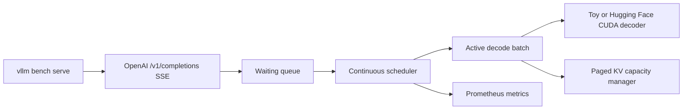

# InferEngine

InferEngine is an inference-serving systems prototype with continuous request admission, decode-step scheduling, paged KV-capacity accounting, a real Hugging Face CUDA backend, streaming OpenAI-compatible completions, and Prometheus telemetry.

The repository now includes a reproducible comparison gate based exclusively on vLLM's official `vllm bench serve` client. It does **not** claim an achieved vLLM-parity number without the required real LLaMA/CUDA implementation and A10G evidence.

## Implemented

- async waiting and active queues;
- continuous admission between decode steps;
- fixed-page KV-capacity allocation with LRU/FIFO pressure policies;
- `/v1/generate`, `/v1/completions`, `/v1/models`, `/health`, `/stats`, and `/metrics`;
- Server-Sent Events with per-token OpenAI completion chunks and usage totals;
- vLLM benchmark-compatible request/response contract;
- official paired benchmark orchestration and a strict 0.91 output-token-throughput gate;
- tests for scheduling, cache lifecycle, concurrent batching, and streaming API compatibility;
- real batched prefill/decode for Hugging Face causal language models with per-request KV state;
- optional Hugging Face `device_map=auto` loading for tight or multi-GPU exploratory environments;
- a standalone Triton fused-QKV projection kernel with CPU layout and CUDA numerical-correctness tests;
- zero-delay active decode loop by default, avoiding artificial inter-token sleeps;
- sequential single-GPU comparison orchestration plus 200 ms NVIDIA utilization/VRAM sampling.

## Verification status

| Resume statement | Status | Required evidence |
|---|---|---|
| matched vLLM within 9% on LLaMA-3 8B/A10G | **not yet verified** | two successful official vLLM JSON results + passing `comparison.json` |
| 38% lower GPU fragmentation | **not yet verified** | real CUDA allocator traces for fixed naive and paged-cache experiments |
| 2.1x longer context at the same VRAM | **not yet verified** | maximum admitted context under a fixed measured VRAM cap |
| 76% vs 41% GPU utilization | **not yet verified** | timestamped DCGM/NVML samples over identical 1,000-request runs |

The laptop-safe toy backend remains the default. Set `INFERENGINE_BACKEND=transformers` for the real CUDA path. The fused-QKV kernel is correctness-tested but is not yet installed into every LLaMA attention layer, and the current per-request KV tensors are repacked for mixed-length batches; therefore the historical parity and memory claims remain unverified until the A10G run passes.

## Architecture



## Local development

The default decoder is intentionally small and runs on CPU. It validates serving mechanics, not LLaMA performance.

Runtime knobs are environment-driven so GPU benchmark runs can tune without code changes:

```bash
INFERENGINE_MAX_BATCH_SIZE=8
INFERENGINE_MAX_PAGES=1024
INFERENGINE_PAGE_SIZE=16
INFERENGINE_DECODE_INTERVAL_MS=0
INFERENGINE_MAX_NEW_TOKENS_LIMIT=512
INFERENGINE_DEVICE_MAP=auto
INFERENGINE_TORCH_DTYPE=float16
INFERENGINE_MAX_MEMORY=0:14GiB,1:14GiB,cpu:48GiB
```

```bash
python -m venv .venv
source .venv/bin/activate
pip install -e '.[dev]'
pytest -q
uvicorn inferengine.api.main:app --host 127.0.0.1 --port 8000
```

Streaming completion:

```bash
curl -N http://127.0.0.1:8000/v1/completions \
  -H 'content-type: application/json' \
  -d '{"model":"torch-toy-decoder/cpu","prompt":"Explain batching","max_tokens":8,"stream":true,"stream_options":{"include_usage":true}}'
```

## Official vLLM comparison

The benchmark tooling is pinned to vLLM 0.23.0 and invokes the same command twice with the same arguments:

```bash
pip install -r bench/vllm/requirements.txt
INFERENGINE_URL=http://127.0.0.1:8000 \
VLLM_URL=http://127.0.0.1:8001 \
MODEL=meta-llama/Meta-Llama-3-8B \
./bench/vllm/run_pair.sh
```

It starts InferEngine and vLLM sequentially on the same GPU, then retains raw console output, complete official JSON results, per-request details, GPU/software environment, Git revision, NVIDIA utilization/VRAM samples, and a machine-readable comparison. See [GPU setup](docs/GPU_SETUP.md) and [the protocol](docs/benchmark.md).

For a no-card Lightning Studio exploratory run, use:

```bash
export HF_TOKEN=hf_your_token
./bench/vllm/run_lightning.sh
```

See [Lightning AI setup](docs/LIGHTNING_AI.md). A Lightning result is publishable only with the exact GPU name shown in `environment.txt`; it is not an A10G claim unless the assigned hardware is A10/A10G-class.

## Development benchmark

For scheduler regressions only:

```bash
python scripts/bench.py -n 64 -c 16 --tokens 80
```

Do not compare this script's output with vLLM. It is not the official harness and uses the toy model.

## Repository map

```text
inferengine/api/       HTTP and OpenAI-compatible streaming API
inferengine/core/      scheduler, tokenizer, and page allocator
inferengine/model/     toy and real Hugging Face CUDA decoders
inferengine/kernels/   optional Triton fused-QKV projection
inferengine/metrics/   Prometheus instruments
bench/vllm/            official paired benchmark orchestration and gate
tests/                 cache, scheduler, and protocol tests
docs/                  architecture and benchmark contract
```

## Remaining claim boundary

The real LLaMA execution path and fused projection kernel now exist, but the headline parity claim still requires the retained A10G result. The next performance step is integrating the fused projection into each LLaMA attention layer and letting attention consume KV pages directly instead of repacking mixed-length caches.
